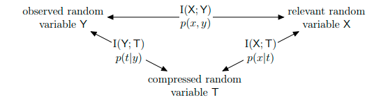

# Machine Learning for Reliable Comminications under Coarse quantization

This repo contains files and code for DL project.

The information bottleneck method was introduced by N. Tishby 1999. Since then, there a lot of variation and implementations of this algorithm have appeared. In communication theory, this method could be used to coarsely quantize channel and belief propagation messages in LDPC decoding process. However, problem of memory consumption and computational cost arise, as for large codes, one struggle from curse of dimensionality. Therefore modern machine learning techniques could be used to replace classical IB algorithms and proceeds decoding faster.

Consider Relevant Random Variable $X$ nodulated at the receiver, observed Random Variable $Y$ at the receiver 
and Comressed Random Varaibale $T$:

To compress R.V. $Y$ into $T$ we could use one this methods: 
1) Agglomerative Information Bottleneck
2) Sequential Information Bottleneck
3) KL − Means Algorithm 

For this algorythms we show ability to preserve mutual information $I(X, T)$ and $I(X;Y)$:

